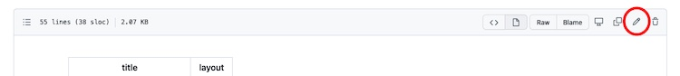
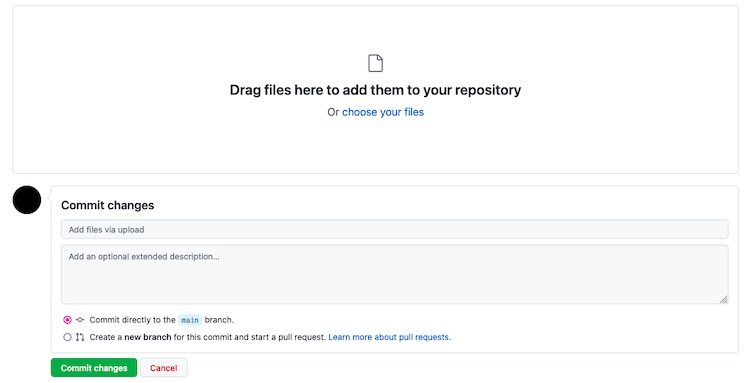

# Client X - Site Manual

Welcome to Client X's online backstage. The following document is for either the site's editors or future developers (aka the webmaster) and designers.

The purpose of this manual is not to provide complete and detailed documentation of all the site's code and functionality but to serve as a general source of information for your reference.

---

**What you'll find here?**
- [Directory structure](#directory-structure)
- [File overview](#file-overview)
- [Update the content](#update-the-content)
- [Style guide](#style-guide)
- [Developer docs](#developer-docs)

## Directory structure

```
.
├── src
│   └── _data
│       └── airtable.js
│       └── gallery.json
│       └── helpers.js
│       └── settings.json
│   └── _includes
│       └── utilities
│           └── schema.njk
│           └── js
│               └── lightbox.js
│           └── css
│               └── about.css
│               └── global.css
│               └── homepage.css
│       └── components.njk
│       └── contact.njk
│       └── default.njk
│       └── drink.njk
│       └── events.njk
│   └── static
│       └── fonts
│           └── AvenirNextLTPro-Cn.woff2
│           └── subset-SpecialElite.woff2
│       └── photos
│           └── owner-image.jpg
│           └── owner_2-image.jpg
│           └── image_1-242.jpg
│           └── image_1.jpg
│           └── image_2-242.jpg
│           └── image_2.jpg
│           └── image_3-242.jpg
│           └── image_3.jpg
│           └── image_4-242.jpg
│           └── image_4.jpg
│           └── image_5-242.jpg
│           └── image_5.jpg
│           └── image_6-242.jpg
│           └── image_6.jpg
│       └── getraenke01.pdf
│       └── speisen01.pdf
│       └── client_x_logo.png
│   └── about.md
│   └── drink01.jpg
│   └── Impressum.md
│   └── index.njk
│   └── privacy-policy.md
│   └── robots.njk
│   └── sitemap.njk
├── .github
│   └── workflows
│       └── backup-airtable.yml
│       └── build.yml
│   └── dependabot.yml
├── eleventy.config.js
├── .gitignore
├── README.md
├── DEV-DOCS.md
├── package.json
└── vercel.json

```

## File overview

`root`
- `eleventy.config.js` - general 11ty configurations: Paths, date formatting, code minification.
- `.gitignore` - files that you don't upload to GitHub.
- `README.md` - the document you're currently reading.
- `DEV-DOCS.md` - an overview of Client X's Airtable integration.
- `package.json` - general information about the repository, scripts, and dependencies.
- `vercel.json` - server configuration: Redirects, cache, and security.

`.github`:
- `dependabot.yml` - GitHub's automatic updates of dependencies.

`.github/workflows`:
- `backup-airtable.yml` - GitHub automation that fetches Airtable data as `JSON` files (see the directory [`src/_data/airtable`](src/_data/airtable)). This weekly backup is **not** used on the site, and is designed to serve as backup in case Airtable stops working for some reason.
- `build.yml` - GitHub automation that builds the site every day at 00:07.

`src`:
- `about.md` - text and photos (portraits only) for the About page.
- `impressum.md`, `privacy-policy.md` - text for the Impressum & Datenschutz pages.
- `robots.njk`, `sitemap.njk` - 11ty templates for generating the corresponding files.
- `drink01.jpg` - photo of Der Drink on the homepage. For maintenance reasons, avoid changing the file name when uploading a new photo.
- `index.njk` - 11ty template for generating the homepage: The otice on the top, Der Drink, and the events table.

`src/_data`:
- `airtable.js` - the script that fetches data from Airtable and stores it in the cache.
- `gallery.json` - file names and captions/alt texts of the photos in the gallery (featured in the About page).
- `settings.json` - site and business details: Title, tagline, navigation, as well name, address, opening hours, and similar information.
- `helpers.js` - 11ty environment variable (used to minify code in production).

`src/_includes`:
- `default.njk` - default site layout, responsible for the markup, and loading styles and script.
- `contact.njk` - the layout for the contact information displayed in the footer: Location & map, social media, additional navigation, and opening hours.
- `drink.njk` - the layout for Der Drink section on the homepage.
- `events.njk` - the layout for the events table on the homepage. *Note: The table is limited to up to 15 events for both readability and visual reasons.
- `components.njk` - partial layout, responsible for loading the header, main content block, and footer of each page.  Also includes the gallery layout and script (About page).

`src/_includes/utilities`:
- `schema.njk` - SEO information for search engines.

`src/_includes/utilities/js`:
- `lightbox.js` - script for the lightbox gallery (enlarged photos) on the About page.

`src/_includes/utilities/css`:
- `about.css`, `homepage.css`, `global.css` - styles for the site and corresponding pages.

`src/static`:
- `getraenke01.pdf`, `speisen01.pdf` - drinks and food menus available for download/viewing via the top navigation. (The _More Drinks_ in Der Drink section on the homepage also links to `getraenke01.pdf`).
- `client_x_logo.png` - Client X logo and tagline as a graphic file for social media shares.

`src/static/fonts`:
- `AvenirNextLTPro-Cn.woff2` - font file for all the text on the site.
- `subset-SpecialElite.woff2` - font file for the logo. Note: this file is a minimal subset version of the font. It includes only the lowercase letters, which make up the business' name.

`src/static/photos`: All the photos on the About page: The page displays two portrait photos and two versions of each photo in the gallery (those ending with the number `242`. The other ones are the larger versions that pop up when clicking).

---

## Update the content via GitHub
The following section includes short guides for updating the sections of the site, uploading new photos or menus, and changing business details and information.

**Important**: Once you click the green `Commit changes` button on GitHub or make any changes on Airtable (see below), the site will automatically update.

If you're not familiar with `markdown` or `JSON` files or feel unsure about the steps below, please consult the webmaster (or the internet) to avoid errors on the site.

### Update the content of the About, Impressum, or Datenschutz pages
1. Open the [site's repository](client_x/client_x_repo) on GitHub.
2. Click [the `src` directory](src).
3. Click the file you want to change: [about.md](src/about.md), [impressum.md](src/impressum.md), or [privacy-policy.md](src/privacy-policy.md).
4. Click the pencil icon on the right (see the screenshot below). Alternatively, click any of the links below to navigate directly to the editing window of each file:
- [About](client_x/client_x_repo/edit/master/src/about.md)
- [Impressum](client_x/client_x_repo/edit/master/src/impressum.md)
- [Privacy policy](client_x/client_x_repo/edit/master/src/privacy-policy.md)
5. When you're done, scroll down to _Commit changes_ and type a summary of the changes you made. For example, "added information about the bar's historical location".
6. Click the green `Commit changes` button on the bottom.



**Important**: These are `markdown` files. If you're unfamiliar with this format, please consult the webmaster (or the internet) to avoid errors on the site.

### Update the content displayed on the homepage
The notice, Der Drink, and events sections are all managed via Airtable. To update the content, follow these steps:
1. Open [Airtable](https://airtable.com).
2. Click on the _base_ named [Client X Site Managment](https://airtable.com/BASE_ID).
3. Select the table you want to edit: _events_, _drink_, or _notice_.

**Important**: Every change you make on Airtable is immediately saved and updated on the site each night.

#### Editing the notice
The notice table has only one field - _Message_. Write what you want inside it.
There's no word/character limit, but it's recommended to be concise (no more than 40 words) for both readability and visual reasons.

If you leave the Message field empty, the Notice section on the homepage will be hidden.

#### Editing Der Drink
The drink table has four fields:
1. _Name_: Can be either the name of the drink on offer or another suitable title. This field is mandatory.
2. _Price_: The price of the offer. This field is optional.
3. _Description_: Description of the drink on offer. This field is mandatory.
4. _Photo_: The file name of the photo on the homepage. Do _not_ change the file name without first uploading a corresponding JPG file to GitHub (see below).

#### Upload a new photo of the drink
To upload a new photo, follow these steps:
1. Open the [site's repository](client_x/client_x_repo) on GitHub.
2. Click [the `src` directory](src).
3. Click the `Add file` button on the right, and select `Upload files` from the drop-down menu. You can also [click here to navigate directly to the upload window](client_x/client_x_repo/upload/master/src).
4. Drag a JPG file from your device or click `Choose your files` to browse and select a JPG file from your device (see the screenshot below).
Depending on its size, it might take a few seconds for the file to upload. Once it does, you will see an indication: The file name with a small `x` on the right. Click the `x` to cancel the upload/delete the file, or continue to the next step.
5. Scroll down to _Commit changes_ and type a summary of the changes you made. For example, "uploaded a photo of this month's wine offer".
6. Click the green `Commit changes` button on the bottom.



#### Editing the Events table
The events table has four fields:
1. _Name_: The name of the artist/band. This field is mandatory.
2. _Description_: Any relevant information about the artist, lineup, etc. There's no word/character limit, but it's recommended to be concise (no more than 40 words) for both readability and visual reasons. This field is mandatory.
3. _Date_: The date of the show. This field is mandatory.
4. _Link_: The URL of the artist's site/YouTube Channel/Spotify or any other relevant link. This field is optional.

*Note: The table is limited to up to **15** events. Additional events will not be displayed on the site's homepage for both readability and visual reasons.

### Upload new drinks and food menus
1. Open the [site's repository](client_x/client_x_repo) on GitHub.
2. Click [the `src` directory](src).
3. Click [the `static` directory](src/static).
4. Click the `Add file` button on the right, and select `Upload files` from the drop-down menu. You can also [click here to navigate directly to the upload window](client_x/client_x_repo/upload/master/src/static).
5. Drag a PDF file from your device or click `Choose your files` to browse and select a PDF file from your device.

**Important**: Make sure the file name is _identical_ to the existing drinks/food menu file: `getraenke01.pdf` or `speisen01.pdf`, respectively.

Depending on the file size, it might take a few seconds for the file to upload. Once it does, you will see an indication: The file name with a small `x` on the right. Click the `x` to cancel the upload/delete the file, or continue to the next step.
6. Scroll down to _Commit changes_ and type a summary of the changes you made. For example, "uploaded a new drinks menu"
7. Click the green `Commit changes` button on the bottom.

### Update contact information and business details
Follow these steps to change the contact information and business details:
1. Open the [site's repository](client_x/client_x_repo) on GitHub.
2. Click [the `src` directory](src).
3. Click [the `_data` directory](src/_data).
4. Click the file `settings.json`.
5. Click the pencil icon on the right. Alternatively, [click here to navigate directly to the editing window](client_x/client_x_repo/edit/master/src/_data/settings.json).
6. When you're done, scroll down to _Commit changes_ and type a summary of the changes you made. For example, "changed opening hours on Thursday".
7. Click the green `Commit changes` button on the bottom.

**Important**: This is a `JSON` file. If you're unfamiliar with this format, please consult the webmaster (or the internet) to avoid errors on the site.

### Adding photos to the gallery
Adding photos to the gallery on the About page requires two steps:
1. Uploading the JPG files to `src/static/photos`.
2. Adding the details of the new photos to `src/_data/gallery.json`.

#### Uploading new photos to the gallery
To upload the photos, see the _Upload a new photo_ section above.
Make sure you upload the photos to the **correct directory** - [click here to navigate directly to `src/static/photos`](src/static/photos).

#### Adding the details of the new photo(s)
1. Open the [site's repository](client_x/client_x_repo) on GitHub.
2. Click [the `src` directory](src).
3. Click [the `_data` directory](src/_data).
4. Click the file `gallery.json`.
5. Click the pencil icon on the right. Alternatively, [click here to navigate directly to the editing window](client_x/client_x_repo/edit/master/src/_data/gallery.json).
6. Add the details of the new photo/s. When you're done, scroll down to _Commit changes_ and type a summary of the changes you made. For example, "added a photo of the bar to the gallery".
7. Click the green `Commit changes` button on the bottom.

**Important**: This is a `JSON` file. If you're unfamiliar with this format, please consult the webmaster (or the internet) to avoid errors on the site.

---

## Style guide
The site's layout and design are defined in three `CSS` files, all stored in `src/_includes/utilities/css`:
- `about.css`, `homepage.css` - include specific styling of the corresponding pages.
- `global.css` - includes site-wide styles.

### Colors
- Dark background: `hsl(40 0% 5%)`
- Lighter background (shades of gray): `hsl(40 0% 80% / .2)`
- Yellow: `hsl(40 100% 60%)`
- Cream: `hsl(40 50% 90%)`

### Fonts
- Client X **logo** font: [Special Elite source](https://fonts.google.com/specimen/Special+Elite)
- All **other** text: [Avenir Next Condensed Regular source](https://www.onlinewebfonts.com/download/164fce79eadeff648f8b1e539b2975db)

The font files are stored in `src/static/fonts`.

*Note: The site follows responsive design principles, which means that spacing, sizes, and positioning are relative to the viewport size (the visible part of the screen).

The only fixed variable is the default base font size in most browsers, which translates into **16px**.

---

## Developer docs
For information about the Airtable integration, see the extended [developer documentation](DEV-DOCS.md).

---

**Design & development**: [Ronny Shani](https://ironnysh.com) and [Liron Milstein](https://air-freelance.com).

The site is built using [Eleventy (11ty)](https://www.11ty.dev).
Hosted on [Vercel](https://vercel.com/).

_Last updated on December 07, 2023_